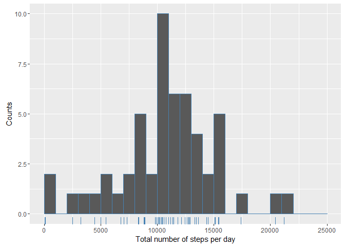
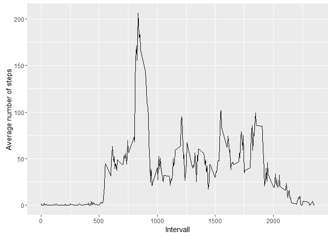
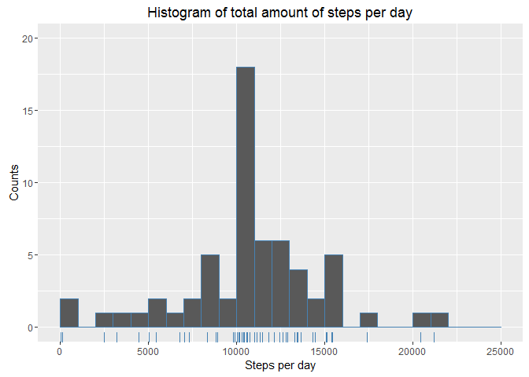
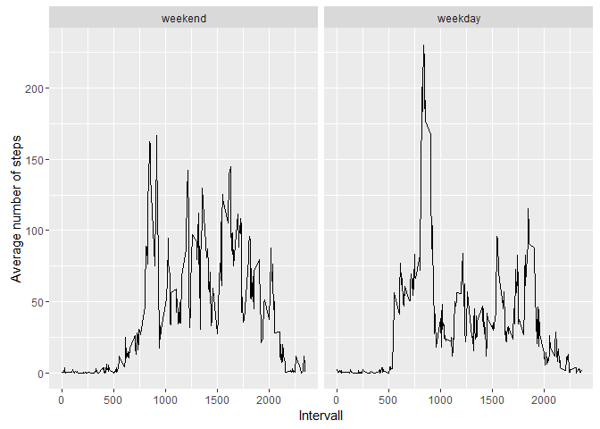

# Reproducible Research: Peer Assessment 1
Sven Langhoff  
21 September 2016  


<br>

# 1. Introduction

This is a work completed to fulfill the first Peer Assignment within the Coursera course 
"Reproducible Research".
This assignment makes use of data from a personal activity monitoring device. 
This device collects data at 5 minute intervals through out the day. 
The data consists of two months of data from an anonymous individual collected 
during the months of October and November, 2012 and include the number of steps 
taken in 5 minute intervals each day.

<br>

# 2. Report of my analysis (step-by-step)

In order to create the following report of my analysis I forked and cloned the [GitHub repository of the 
course instructor](https://github.com/rdpeng/RepData_PeerAssessment1).
This repository contains the zip container `activity.zip` with the dataset for the assignment.

<br>

## 2.1. Setting options and loading packages

In the beginning of every R script I insert some kind of a standard preamble to 
clear the environment, close all open devices, set the working directory, and load 
necessary packages.

```r
# Clear Environment and set Working Directory
rm(list=ls(all=TRUE))
graphics.off()
setwd("C:/Users/Sven/Documents/@Projects/DataScience/rCodes/Coursera_05_ReproducibleResearch/RepData_PeerAssessment1")

# Options for time locale to display weekdays in English
Sys.setlocale("LC_TIME", "English")

# Packages
library(dplyr)
library(ggplot2)
```
**A useful hint**: In normal script files (.R) I use the command `setwd(dirname(sys.frame(1)$ofile))` to set the working directory automatically. For this the script must be saved in the right directory and sourced via RStudio.

<br>

## 2.2. Loading and preprocessing the data
Before starting with the analysis the available data needs to be unzipped and loaded. 
Since there is a variable for the date, this variable is converted into class "Date".   

```r
unzip("activity.zip")
activity      <- read.csv("activity.csv")
activity$date <- as.Date(activity$date, format="%Y-%m-%d")
```

<br>

## 2.3. What is the mean total number of steps taken per day?
The first part of the analysis focuses on the activity that the individual performed each day. The main question is how many steps the indivual in average per day.

<br>

#### 2.3.1. Calculating total number of steps taken per day
To do this the total number of steps taken per day must be calculated first:

```r
stepsPerDay <- activity %>%
        group_by(date) %>%
        summarise(sumSteps=sum(steps))
```
The created object **stepsPerDay** is a data frame with 61 rows and 
61 columns that looks like this:

```
## # A tibble: 6 × 2
##         date sumSteps
##       <date>    <int>
## 1 2012-10-01       NA
## 2 2012-10-02      126
## 3 2012-10-03    11352
## 4 2012-10-04    12116
## 5 2012-10-05    13294
## 6 2012-10-06    15420
```
For each day the total there is the total number of steps.

<br>

#### 2.3.2. Plotting a histogramm of total number of steps per day
By plotting a histogram we can get a first feeling for the distribution of steps taken per day

```r
ggplot(stepsPerDay, aes(sumSteps)) + 
        geom_histogram(breaks=seq(0,25000, by=1000), col="steelblue") + 
        ylim(c(0,10)) +
        geom_rug(col="steelblue") +
        labs(x="Total number of steps per day", 
             y="Counts")
```

<!-- -->

**First observations**: By looking at the histogram, the average number of steps per day should be somewhere between 10000 and 12000. Because the distribution appears to be slightly right-skewed, one can assume that the median is smaller than the mean.

<br>

#### 2.3.3. Calculating the mean and median
Let's check the before mentioned assumtion and calculate the values for the mean and median. 

```r
spdMean   <- mean(stepsPerDay$sumSteps, na.rm=T)
spdMedian <- median(stepsPerDay$sumSteps, na.rm=T)
```
The **mean is 10766** and the **median is 10765** so that the first assumption holds to be TRUE.

<br>

## 2.4. What is the average daily activity pattern?
In the next step of the analysis we examine the question of how the activities (steps) are distributed over a day in average. Are there times during the day, where the individual did in average more steps than during other times of the day?

<br>

#### 2.4.1. Calculate the average amount of steps per intervall
Similar to the step in the first part of the analysis we calculate first the data we need for further investigations. Here we calculate the average amount of steps per time intervall over all days. 

```r
stepsPerInt <- activity %>%
        group_by(interval) %>%
        summarise(avgSteps=mean(steps, na.rm=T))
```
**Notice**: Each intervall is 5 minutes long. The Identifier for each intervall has the following pattern:
 
 - For every hour there are the identifiers `05, 10, 15, ..., 55` for each interval. 
 - Except for the first hour of the day (0h00 - 1h00) the hours are indicated by the first digit of the identifier. So for example the identifier `505` indicates the time intervall between 5h00 and 5h05.   

<br>

#### 2.4.2. Plotting a time series over the average number of steps per intervall

```r
ggplot(stepsPerInt, aes(interval, avgSteps)) + 
        geom_line() +
        labs(x="Intervall", 
             y="Average number of steps")
```

<!-- -->

**Observations**: Most of the days the indivdual stands up shortly after 5h00 in the morning. At around 8h00 there is a peak which indicates that the individual does some kind of activity. Maybe some sports or walking to go to work. In average the individual is active until around 19h00 and doesn't do so many steps in the evenings.  

<br>

#### 2.4.3. Find the most active time intervall  

The time intervall where the individual is in average most active across all days can be found in the calculated data frame `stepsPerInt` in the following way:

```r
stepsMax <- stepsPerInt$interval[which.max(stepsPerInt$avgSteps)]
```
It turns out that the intervall in which the indivual is in average most active is 835, which means in the time between 8h30 and 8h35 in the morning. 

<br>

## 2.5. Imputing missing values
Since we saw alread in section 2.3.1. that there are a number of days/intervalls where there are missing values we have to examine the question, whether the NAs introduce a bias into our calculations or not.

<br> 

#### 2.5.1. Filling in all of the missing values in the dataset
In total there are

```r
sum(!complete.cases(activity))
```
2304 missing values that need to be replaced/imputed.

The **strategy** to impute the missing values will be to replace each NA with the average number of steps for a given time intervall. The code for this looks like this:

```r
# Merge activity dataset with data about average number of steps per intervall 
activityUpd  <- merge(activity, stepsPerInt, by="interval")
# Create an index that points to the position where NAs need to be replaced
index        <- !complete.cases(activity$steps)
# Order the new dataset in the same way like the original one
activityUpd  <- arrange(activityUpd, date, interval)
# Replace the missing values in 'steps' with the average number of steps
activityUpd$steps[index] <- activityUpd$avgSteps[index]
```

<br>

#### 2.5.2. Redo the first analysis shown in section 2.3
With the updated dataset `activityUpd` we redo the analysis we did before in section 2.3. This means we again calculate the total amounts of steps for each day, plot afterwards a histogram of the total number of steps taken per day, and calculate the mean as well as the median.


```r
stepsPerDay2 <- activityUpd %>%
        group_by(date) %>%
        summarise(sumSteps=sum(steps)) 

ggplot(stepsPerDay2, aes(sumSteps)) + 
        geom_histogram(breaks=seq(0,25000, by=1000), col="steelblue") + 
        ylim(c(0,20)) +
        geom_rug(col="steelblue") +
        labs(x="Steps per day", 
             y="Counts",
             title="Histogram of total amount of steps per day")
```

<!-- -->

```r
spdMean2   <- mean(stepsPerDay2$sumSteps)
spdMedian2 <- median(stepsPerDay2$sumSteps)

spdMean2
```

```
## [1] 10766
```

```r
spdMedian2
```

```
## [1] 10766
```

<br> 

#### 2.5.3. Examining the difference to the result from the first analysis 
After the imputation of missing values the **mean value didn't change**, whereas the **median value moved towards the mean value and is equal to the mean**.

If we examine the structure of the missing values we can see that if missing values occured, they always occured over the course of a whole day. This is shown by the following code:

```r
# Select dates and intervalls where NAs occured
naOccurence <- activityUpd[index, c("date","interval")]
# Add column with 1s for counting
naOccurence$one <- rep(1, times=dim(naOccurence)[1])
# Count the number of NA per date
numberPerDay <- naOccurence %>%
        group_by(date) %>%
        summarise(countNA=sum(one))
print(numberPerDay)
```

```
## # A tibble: 8 × 2
##         date countNA
##       <date>   <dbl>
## 1 2012-10-01     288
## 2 2012-10-08     288
## 3 2012-11-01     288
## 4 2012-11-04     288
## 5 2012-11-09     288
## 6 2012-11-10     288
## 7 2012-11-14     288
## 8 2012-11-30     288
```
Per day there are exactly 288 5-minute intervals. For the days shown above the step measurements are missing therefore for the whole day and are replaced by the mean values for every interval. The total amount of steps for these days are therefore equal to the mean total number of steps taken per day (=10766). This can be seen also in the histogram and explains as well the shift of the median towards the mean.

<br>

## 2.6. Are there differences in activity patterns between weekdays and weekends?
The last analysis focus on the differences in activity pattern between weekdays and weekends. The analysis that needs to be done is comparable to the one we did already in section 2.4., whereas we now have define the average daily activity pattern on time for weekdays and a second time for weekends.

<br>

#### 2.6.1. Create new factor variable
Todo this we need to define a new variable that we can use afterwards to group the data:

```r
activityUpd$weekday <- weekdays(activity$date)
weekendDayNames <- c("Saturday", "Sunday")

activityUpd$weekend <- factor(weekdays(activity$date) %in% weekendDayNames,
                           levels = c(TRUE, FALSE),
                           labels = c("weekend", "weekday"))
```

<br>

#### 2.6.2. Calculate the average amount of steps per intervall grouped by weekday/weekend
Like before we calculate the necessary data, whereas now we group the data first by weekend and then by interval.

```r
stepsPerInt2 <- activityUpd %>%
        group_by(weekend, interval) %>%
        summarise(avgSteps=mean(steps, na.rm=T))
```

<br> 

#### 2.6.3. Plotting the time series over the average number of steps per intervall


```r
ggplot(stepsPerInt2, aes(interval, avgSteps), groups(weekend)) + 
        geom_line() +
        facet_grid(facets=.~weekend) +
        labs(x="Intervall", 
             y="Average number of steps")
```

<!-- -->

**Observation**: The activity peak at 8h30 that was observable also before occurs only during the weekdays. Further  investigation could follow the question if this peek occurs on every day or only on specific days. If this pattern occurs on every weekday one could assume that this activity is work related. 
